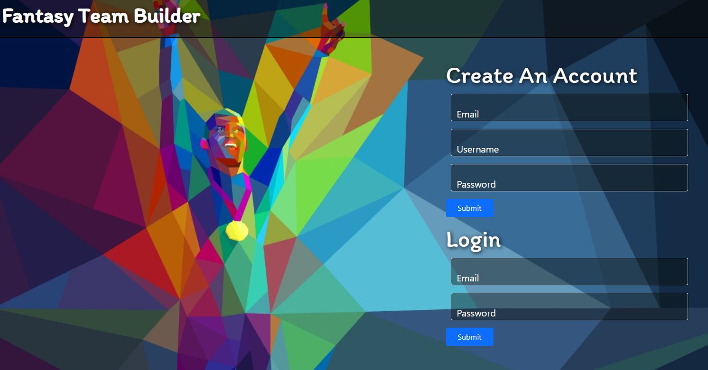
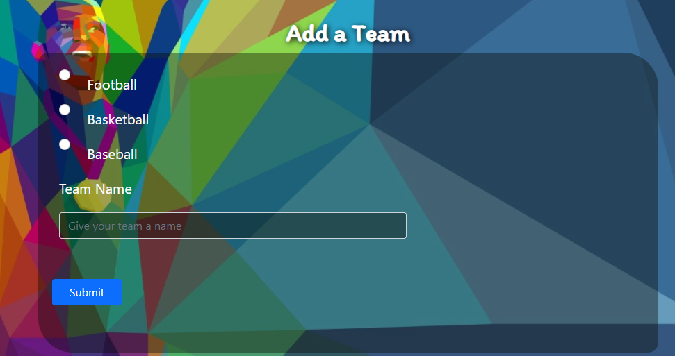
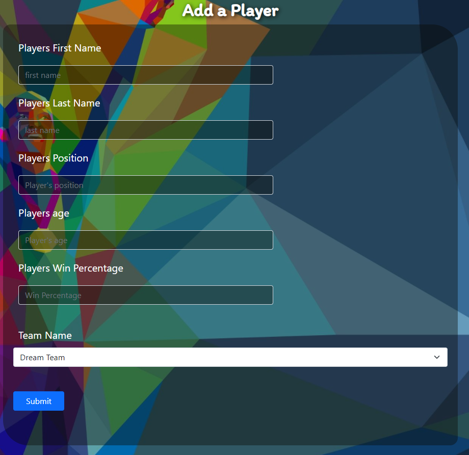
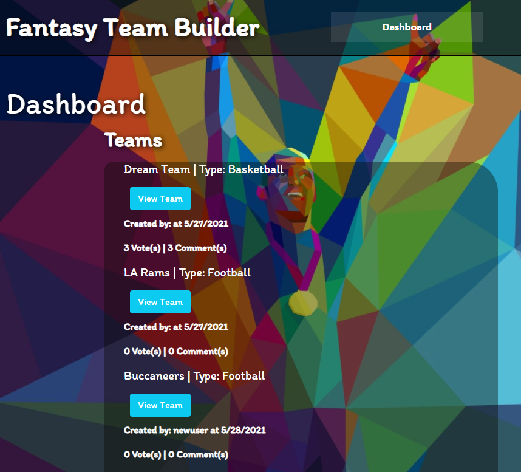

# <ins>Fantasy Team Builder</ins>

## Description 

a fantasy sports app where you can build your dream team. Users can publish their own teams and comment on other users teams as well. This app follows the MVC paradigm in it's structure, using handlebars.js as the templating language, Sequelize as the ORM, bcrypt for password hashing, Axios for fetch calls, and the express-session npm package for authentication

(click any screenshot to go to the deployed app)

<a href="https://fantasy-team-builder.herokuapp.com/" rel="demo"></a><br>
<a href="https://fantasy-team-builder.herokuapp.com/" rel="demo"></a><br>
<a href="https://fantasy-team-builder.herokuapp.com/" rel="demo"></a><br>
<a href="https://fantasy-team-builder.herokuapp.com/" rel="demo"></a><br>


# <ins>Usage</ins> 

[View Deployed App](https://fantasy-team-builder.herokuapp.com/)

***NOTE: MySQL must be installed on your computer***

1. Inside your CLI
```
mysql -u root -p and enter your MySQL password.
```
2. Run the schema.sql file (CLI)
```
source db/schema.sql then quit;
```
3. Install dependencies 
```
npm i
```
4. Start the server
```
npm start
```

# <ins>Technology</ins>
* bcrypt
* Node.js
* Express.js
* Axios
* Express-Handlebars
* Express-Session
* MySQL
* Dotenv
* Sequelize

# <ins>Questions?</ins>

GitHub: [@jshmtchll](https://github.com/users/jshmtchll), [@KaleTEvans](https://github.com/KaleTEvans), [@cchester11](https://github.com/cchester11), [@BradenWelsh](https://github.com/BradenWelsh), [@ttheis1611](https://github.com/ttheis1611)


        
Email: jshmtchll@gmail.com